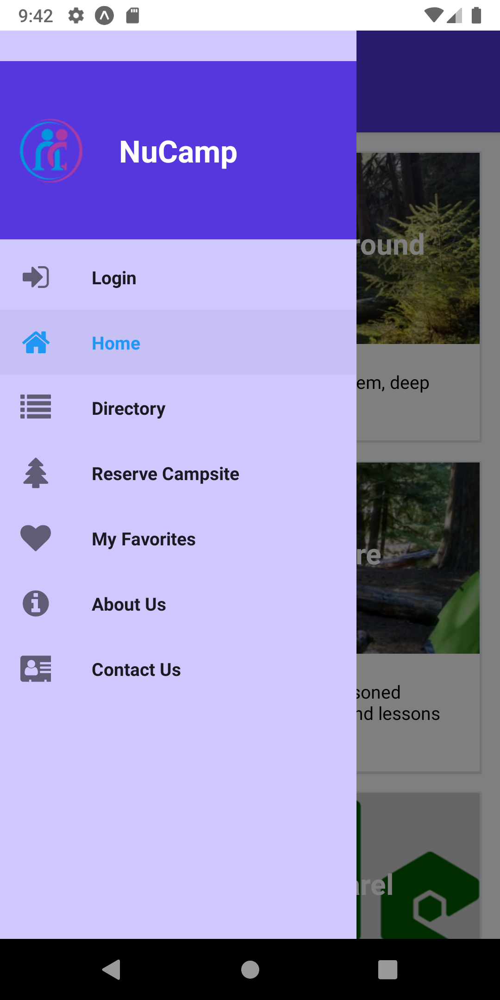
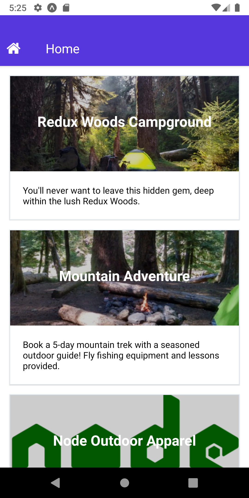
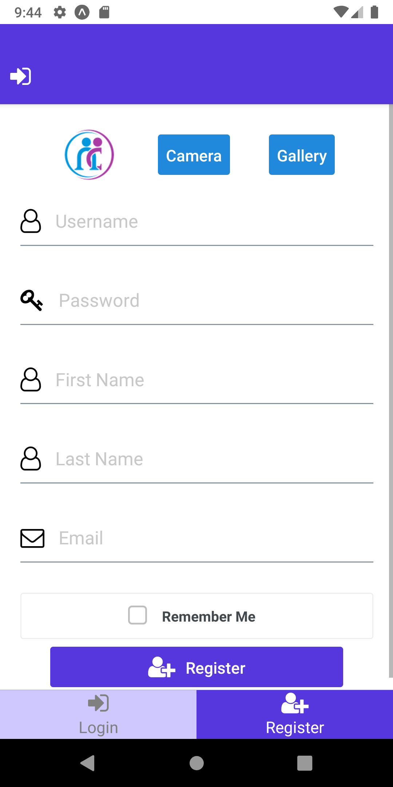
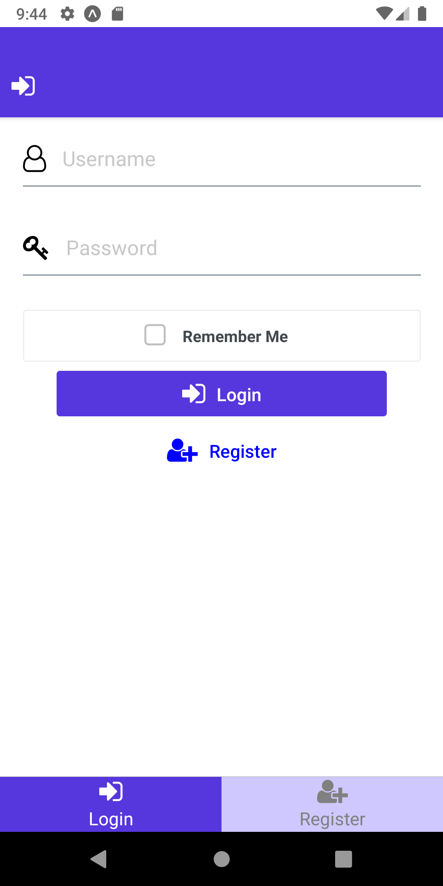
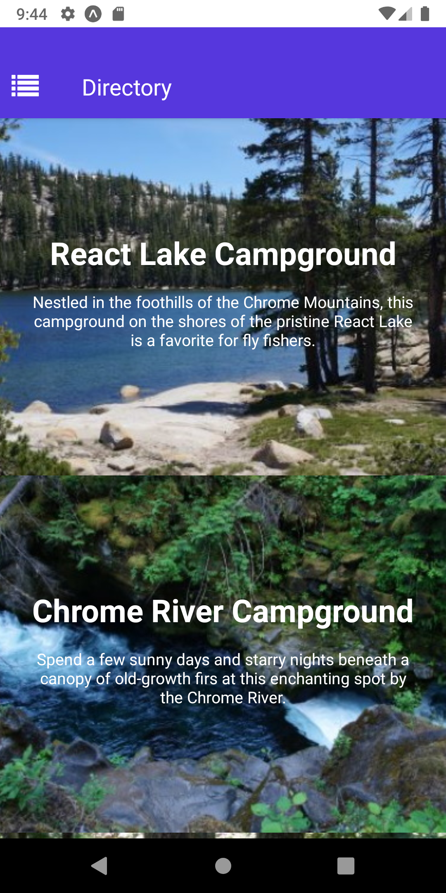
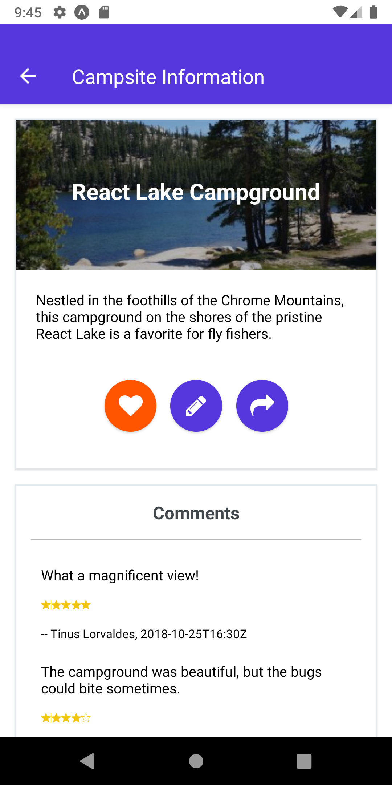
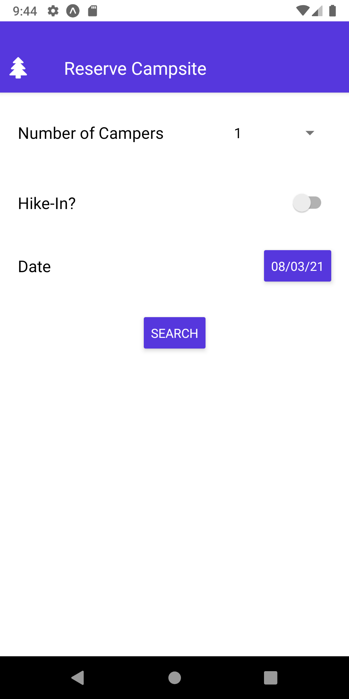

# nucampsite-reactnative
Application created throughout the course of the Nucamp Bootcamp. 
Built for mobile using React Native and Expo SDK. Tested on Pixel 3 with Android 9.0 via Android Studio, requires Expo v38 or v39.

Allows users to explore information on campsites, review and post comments, and register for campsites.

 &nbsp;&nbsp;&nbsp;&nbsp; 

 &nbsp;&nbsp;&nbsp;&nbsp; 

 &nbsp;&nbsp;&nbsp;&nbsp; 

 

